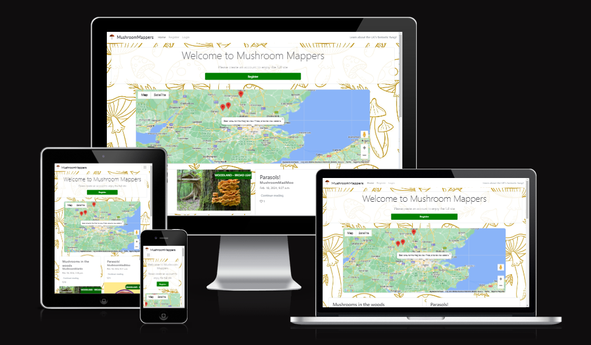
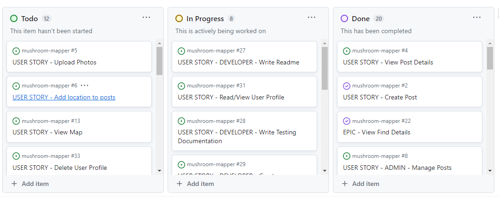
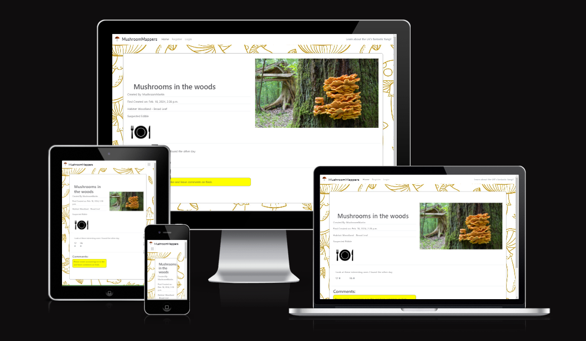
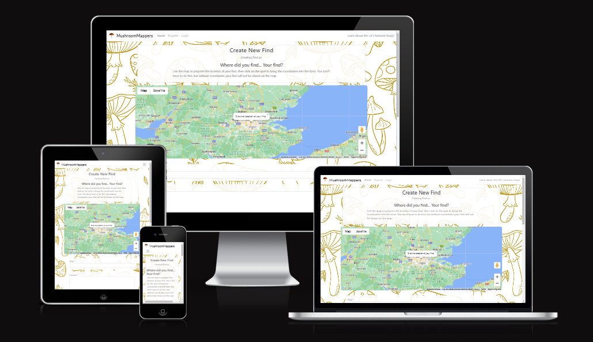
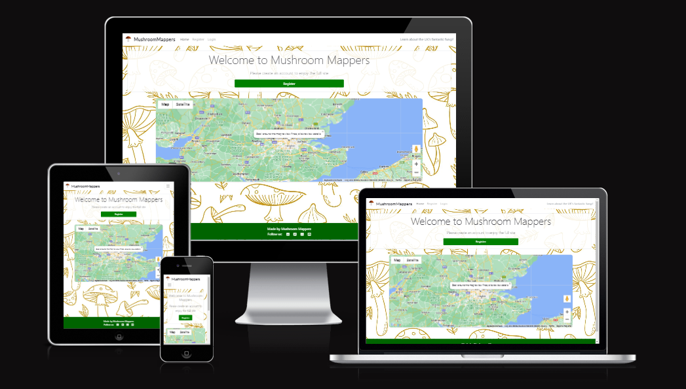
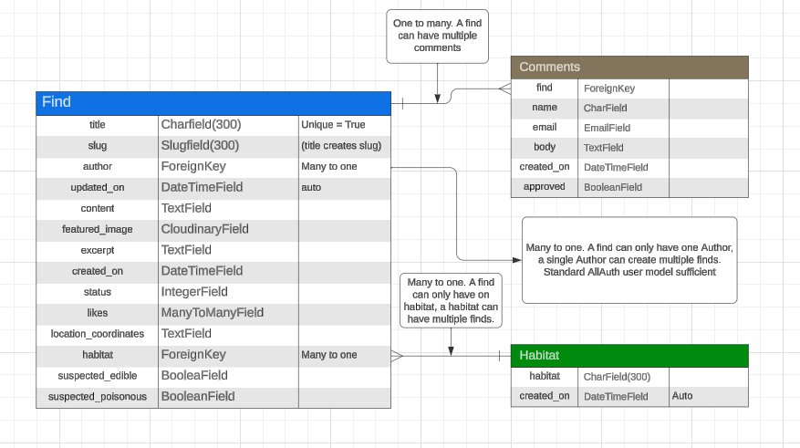
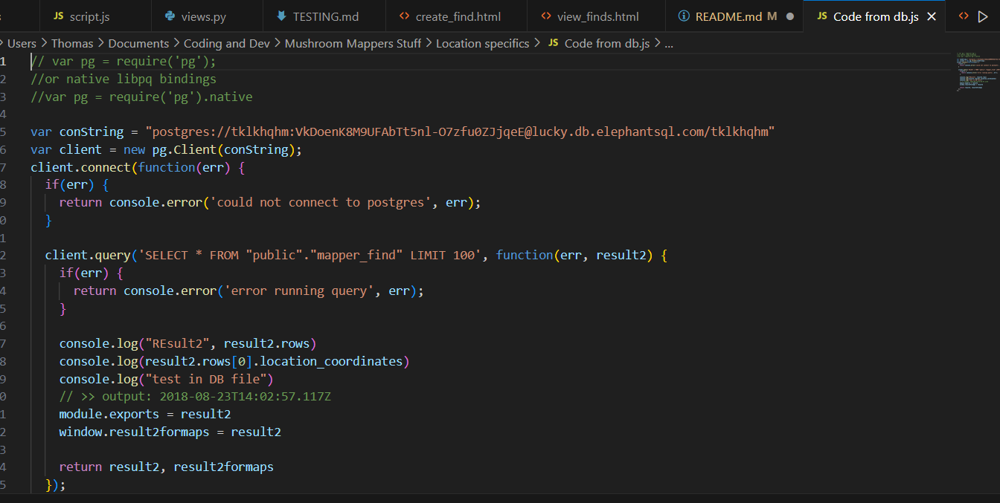

# Mushroom Mapper

## Overview

Mushroom Mappers is a project intended to provide an interactive application for foraging enthusiasts to share images, thoughts and research on mushrooms they have found in their local area.

Please use the link below to view the live, deployed site:

[Mushroom Mappers - Live Site](https://mushroom-mapper-6a227ba72c70.herokuapp.com/)

## CONTENTS

- [Mushroom Mapper](#mushroom-mapper)
  - [Overview](#overview)
  - [CONTENTS](#contents)
  - [User Experience Design](#user-experience-design)
    - [The Strategy Plane](#the-strategy-plane)
      - [Site Goals](#site-goals)
      - [Agile Planning](#agile-planning)
        - [Epics](#epics)
        - [User Stories](#user-stories)
    - [The Scope Plane](#the-scope-plane)
    - [The Structure Plane](#the-structure-plane)
      - [Features](#features)
      - [General Features On All pages](#general-features-on-all-pages)
      - [Nav Bar](#nav-bar)
      - [Footer](#footer)
      - [Register/Sign Up Page](#registersign-up-page)
      - [Homepage](#homepage)
      - [Post Page](#post-page)
      - [404 Error Page](#404-error-page)
    - [The Skeleton Plane](#the-skeleton-plane)
      - [Wireframes](#wireframes)
      - [Database Design](#database-design)
      - [Security](#security)
    - [The Surface Plane](#the-surface-plane)
      - [Design](#design)
        - [Colour Scheme](#colour-scheme)
        - [Typography](#typography)
        - [Imagery](#imagery)
  - [Future Implementations/Plans](#future-implementationsplans)
    - [Accessibility](#accessibility)
  - [Technologies Used](#technologies-used)
    - [Languages Used](#languages-used)
    - [Libraries and External Sources](#libraries-and-external-sources)
  - [Deployment](#deployment)
  - [Local Development](#local-development)
    - [How to fork](#how-to-fork)
    - [How to clone](#how-to-clone)
  - [Testing](#testing)
  - [Credits](#credits)
    - [Code Used](#code-used)
      - 
  - [Acknowledgements](#acknowledgements)

## User Experience Design

### The Strategy Plane

#### Site Goals

The application is designed to be an engaging and social platform for mushroom foraging enthusiasts can share pictures and ideas on what they have found out in the wild. 

The site aims to be fun, easy to use and promote the values of safe, sustainable foraging whilst highlighting the importance of caution and sharing of accurate, reliable information to avoid mishaps. 

#### Agile Planning

This application was designed and built in line with Agile methodologies, with small, incremental features developed over controlled sprints. There were XXXXXX sprints spaced out XXX weeks. 

Each feature was assigned an epic and individually prioritised following the MoSCoW rating system, being designated Must have, Should have, Could have and Won't have. These designations were assigned based on perceived requirements of the site users and the effort required to develop them. Features were developed with Must have's being completed first, and so on, to ensure that the most useful and fundamental aspects of the site were built first, with 'bells and whistles' features being completed later depending on the time left. 

A kanban board was used to track the progress and manage the development lifecycle, the completed board can be viewed here:

https://github.com/users/TomLiDev/projects/2/views/1

#### Epics

The project had 6 Epics which encompass the main development effort for Mushroom Mappers. Each epic includes some key elements with more detailed user stories explained below.

EPIC 1 - Project Set Up

This epic incorporates the user stories required for the initial project set up and initial deployment. This epic and the user stories within was the first to be completed.

- Install Django and other necessary libraries
- Ensure env.py and other sensitive information kept secure
- Successfully deploy via Heroku early prior to main development effort

EPIC 2 - Create Project Documentation

An ongoing epic until project completion, although this does include user stories in the traditional Agile sense, I felt it was important and useful to have a note to keep aspects such as project secrets hidden as necessary throughout the project. Due to issues with reliability several different workspaces were created during the development of this project, therefore the reminder to keep relevant pieces of information secret was useful.

- Write and maintain project Readme
- Write and maintain testing doc
- Create github issue request, epics and project board whilst maintain clear commit messages throughout dev lifecycle.

EPIC 3 - Authentication: Sign in/out and registration

A key epic, this includes the user stories to allow a user to create their initial profile and access the full site, sign out and sign in, whilst also providing security and control and users accessing and managing their own accounts. This epic also includes specifying and controlling what content and functionalities an authenticated, signed in user can access versus a 'generic' user who has not yet created an account.

- Create user account
- Sign In
- Sign Out
- Control site access based on authentication

EPIC 4 - CRUD User Finds

This epic includes the user stories for users creating, reading, updating and deleting their own finds on the application. Finds are intended to be the key, main content of the application, which users will create, read, like and generally interactive with. To achieve these in a user friendly, appealing way user stories such as users being able to view a single, filtered page of their own finds was also included in this epic. 

- User Create Finds
- User Update/Edit Finds
- User read Finds
- User Delete Finds

#### User Stories

The below is a list of the user stories linked and required to achieve completion of each Epic, with a brief one line description of the epic itself and some of the key elements for it to be completed. Each user story was created with a specific list of tasks which act as acceptance criteria and facilitate an objective determination on whether the functionality was developed, and user story completed, to the required level. Some user stories do not have a more detailed acceptance criteria as this is not necessary, e.g. create Readme. 

EPIC 1 - Project Set Up
As a Developer I will perform the initial project set up so I can continue and complete the development of this project

#15 Django and Required Library Set Up - 2 story points
#25 Keep secret details safe - 1 story point
#26 Deploy App Early to Heroku - 1 story

EPIC 2 - Project Documentation
As a developer I will create the project documentation so that other developers and interested parties can understand the project and its purpose in more detail and create their own if desired.

#27 Write and maintain project Readme - 4 story points
#28 Write and maintain testing doc - 4 story points
#29 Create github issue request, epics and project board whilst maintain clear commit messages throughout dev lifecycle - 2 story points

EPIC 3 - Authentication: Sign in/out and registration
As a User or Admin I can log in and out of the site so I can ensure details are kept secure and access to the site is controlled.

#30 USER STORY - Create Profile - 2 story points
#34 USER STORY - Sign In - 2 story points
#35 USER STORY - Sign Out - 2 story points

EPIC 4 - CRUD User Finds

As a User I can Create, read, update and delete my finds so I can share my finds and information, update information I have already shared and delete any information I no longer want to be public.

#36 USER STORY - Create Finds - 4 story points
#38 USER STORY - User Update/Edit Finds - 2 story points
#37 USER STORY - Read Finds - 1 story points
#39 USER STORY - User Delete Finds - 2 story points

EPIC 5 - Interact with finds

As a user I want to comment and like other user finds, as well as interact with my own in a similar way so I can respond to other users comments and interaction.

#40 USER STORY - User Like Posts
#11 USER STORY - Comment on finds

As a could have, the epic of User Notification was not prioritised over others in the development and were therefore not completed. The below are the epics and stories which were not included in the final application, but I would like to explore in the future.

COULD HAVE - EPIC 6 - User Notification

As a User I can be notified when someone likes/comments my finds so I can Keep track of which posts are most popular and report any offensive comments to admin

#45 USER STORY - Notification on the site when Find liked/commented on
#46 USER STORY - Email notification when Find liked/commented

WON'T HAVE - EPIC 7 - Location Based Suggestion

As a User I can be notified when another user creates a find which is geographically close to my address so I can be automatically notified on other users finds in areas close to me

#47 USER STORY - Option for location based notifications
#48 USER STORY - Receive Location Based Suggestions

### The Scope Plane

- Home page. A visually attractive home page capturing the core essence of thee Mushroom Mappers site. 

- Ability to perform CRUD functionality on Finds. Users and admins will have the ability to create, read, update and delete finds. 

- Authentication/Role based functionality. Different functionality and abilities will be available to users who have registered and logged in to their account, unauthenticated users will have a more limited option of functionality to encourage sign up and long term engagement with the site. 

- Responsive Design. The application will resize and maintain relevant functionality across all modern device screen sizes. 

### The Structure Plane

### Features

### General Features On All pages

#### Nav Bar

Every page will retain the same navigation bar across the top of the screen. This will provide links/options for:

All users:
Home - Return to home page

Unauthenticated User:
Register - Redirect to a signup page providing a form to create an account

Authenticated/logged in user
Home - Return to home page
View Account - Display details of the users account with some options for account management
Logout - Display logout page to confirm account log out and return to homepage

#### Footer

Every page has the same footer bar comprising icon links to Facebook, Twitter (X), Instagram and Youtube with 'Made by Mushroom Mappers' above the icons. This will remain the same throughout site navigation for all users. 

### Register/Sign Up Page

To access the site each user will be required to create an account. This page will prompt them to enter their name, email address and create a password of suitable complexity. Once these steps have been successfully carried out the user will see a message confirming account creation and will be allowed to access the main site.

### Homepage

All users will be able to see a home page. 

After logging in the user will be presented with the homepage. This will show a welcome message with the option to register an account for a non authenticated user, or options to create find and view existing finds for an authenticated user. 

Below this will be the map for any user to scroll and view existing finds.

Below this will be a list of the latest finds with some of the brief key pieces of information shown against each. Each find will have a link prompting the user to continue reading and view find details. Each find will have a small thumbnail like image presented against it on the homepage.

### Find Details Page

If a user clicks into a find they will be presented with the full details of that find. This will comprise a larger image of the find with the title, creator, created date displayed, the content of the find and icons indicating is the find is potentially edible or poisonous. Below these pieces of information is the full text of the post itself.

Below this are the options to like, with a counter, and comment, with a counter for comments. Only authenticated users will be able to leave a comment.

### Create Find Page

Authenticated users will be able to enter the create find page, which displays a short piece of text explaining what needs to be done to complete and submit a find for approval. 

A map is displayed to allow a user to easily and intuitively click on the map where they found their find. The rest of the form follows below this with boxes of information to be filled in for the form submission, and finally a submit button in green to create the find.

### Edit Find Page

Very similar to the Create Find page, except the details of the find will be populated in the form to be edited. A different Edit Find button is also displayed at the end of the form and a different confirmation message is displayed on successful submit. 

### View Finds Page

This page will display a list of the logged in users finds. Each find will be displayed with the options to edit, which will open the edit find form, and delete find. The delete find button will return a confirmation window, if confirmed the find will be deleted and an updated list of the user finds will be displayed back to them.

A responsive image of View Finds could not be provided as a user has to be authenticated to view their own finds, and this meant Am I Responsive could not access it. 

### Error Pages (404, 403 and 500)

All error pages will be shown if there is an error somewhere in the navigation/direction in using the page.

This will incorporate the nav bar and footer links as all the other pages. Centrally, a simple message will inform the user of the error type with a green button to return to home page. 

### The Skeleton Plane

#### Wireframes

Please use the links below to view the relevant wireframes, both desktop and mobile for each page.

[Homepage Wireframes](documentation/homepage-wireframe.PNG)

[Create Find Page Wireframe](documentation/create-find-wireframe.PNG)

[View Finds Page Wireframe](documentation/view-finds-wireframe.PNG)

[Find (Individual) Detail Wireframe](documentation/find-detail-wireframe.PNG)

[Error page Wireframe](documentation/wireframe-error-page.png)

As the edit find page is structurally the same as create find a separate wireframe is not needed.

#### Database Design

The database was designed to support CRUD functionality to logged in users. A custom model was not needed for users as the Allauth standard user model was sufficient. 

I was keen to keep the database relatively simple and not create excess models/fields simply for the sake of it. The User and Find models are the key aspects of the site. Habitats are linked to Finds by a Many to one relationship. Comments are linked to finds in a One to Many relationship. 

The entity relationship diagram below was created using Lucid charts and shows schemas for each model, their relationships to the other models, field types, and any relevant notes on each field. 

#### Security

Views and data are secured in the first instance by user authentication. Finds which are yet to be approved can only be viewed by the authenticated user. Only the original author can edit or delete their specific finds. The exception is of course admins via the admin console.

This security is further enforced by incorporating a check in the views, to ensure that the logged in user equals the find author.

Environment variable were stored in env.py which was never committed to the github repository. This ensured all keys and secrets remained safe and secure.

One API key which required particular security management was the Google maps API key. After thorough research to ensure I was not mistaken, a Google maps API key has to made visible in the site code to allow the script to function properly. This is unavoidable, the key cannot be stored in env.py and called in. To protect against any malicious attack, I used restrictions on my Google API credentials to ensure that only calls coming from specific pages of my site would be allowed to use the API. In addition, I set a volume cap on how much the API can be called. 

### The Surface Plane

#### Design

#### Colour Scheme

As a site dedicated to a largely autumnal, natural outdoor pursuit, I will use greens, browns and yellows and in my colour scheme. Care will be taken to ensure that their is sufficient contrast between text and any background colours to support easy reading. Similarly, many mushrooms are not particularly colourful, so care will need to be taken to ensure images of mushrooms themselves are not overpowered by background or theme colours. As autumn is typically the time of year for greatest mushroom abundance I may also use dark reds and yellows.

The background, a mushroom outline repeating pattern, gives a nice pale backdrop with the mushroom outlines themselves in a mustard-yellow. This gives a good canvass for more bold colours for specific points of interest on the site, whilst also allowing sections, such as individual find 'cards' and other site messages to stand out relatively easily with a simple all-white background.

For points of interest, such as buttons, green and red were used, with white text inside, whilst the rest of the site used a dark grey text.

#### Typography

Lato is used as the standard font across the site. 

#### Imagery

Apart from some relatively small icons and logos the site imagery itself will be kept minimal as to maximise focus on attention on users images of mushrooms.

The exception to this will be the poisonous mushroom logo which will deliberately be made bold so that it stands out.

## Future Implementations/Plans

In the future I would like to incorporate:

1. JSON/AJAX to Communicate Data - Getting Javascript and Django/Python to 'talk' to each other was an ongoing challenge during this project. This most prominent in creating the map markers (more detail below). I did explore in detail the possibility of incorporating JSON and AJAX calls to push/pull data from different parts of the system, however this isn't something I was familiar with and simply couldn't afford to spend the time to learn from scratch for functionality which wasn't crucial for the project. 

The closest I got was having data pulled from the elephant sql, into a db.js file. Using this, I was able to retrieve and see the find data by running the db.js in js.node, image of the code below.

With this I was able to print the Find data to the terminal. However I than ran into a similar issue of getting the data over from db.js into script.js (have come to understand this is server side vs browser side Javascript). Despite a lot of investigation with these mechanisms and different combinations, it was simply taking too much time to find a working solution and this was beyond the scope of what student support could reasonably be expected to help with. I therefore settled on creating hidden divs on the index page which container the data using a Django for loop. Whilst this is less 'slick' it is perfectly functional, although the hidden text did raise alerts on WAVE testing. 

In the future I would like to explore a more advanced mechanism to achieve this communication of data between the different parts of the application. One of the key reasons is described below. 

2. Customised Advanced Google map markers - Initially I began the creation of the map markers with the relatively new, Advanced Marker available with the Google maps API and imported libraries. I did get to the point where I had markers being plotted on the map with a custom image, the same image as the placeholder mushroom icon, with it sized appropriately to fit on the map. 

My intention was to have each find represented on the map with its uploaded image, in miniature, as the marker icon. This would be accompanied with the title of the each find, so as to make each marker truly unique and make the map highly engaging for the user. However I ran into issues with incorporating the user-uploaded image into Javascript using Django code, the 2 things simply weren't compatible. Despite a lot of exploration (described above) I couldn't get this working ideally as I would have liked. I did consider pushing the Find image to the hidden index divs, along with the other data, but this could have led a lot of image data being loaded on the page and caused performance issues. 

In the end I settled for the simpler, but still perfectly functional, standard marker, with a custom InfoWindow, within which is incorporated an anchor element which redirects to the detail of the find it represents. Annoyingly, the standard InfoWindow does not seem capable of supporting both the find-slug variable and the created anchor variable. In the future I would like to incorporate advanced markers which still provide the functionality to view the detail of the particular find as a link, whilst supporting the finds particular image and title. 

### Accessibility

This site has been built to be as accessible as possible, specifically:

- All images have alt text attributes and all links have aria labels for use by screen readers.

- The colour scheme has been chosen to ensure a good level of contrast is maintained for text across the site.

- Semantic markup has been used throughout.

- Including hover states to aid navigation.

## Technologies Used

### Languages Used

HTML, CSS, Python and Javascript were used. 

### Libraries and External Sources

- Git - Version control.

- Github - To save and store code for the website itself.

- Code anywhere - The workspace and IDE for producing the site.
- MS Visual Studio - Later replaced Code Anywhere due to reliability. 

- Bootstrap - For styling and site components.

- Django - For site construction.

- Crispy Forms - For form styling and display.

- Lucidchart - For wireframes and models.

- Coolors - Colour Palette

- Google fonts - For imported fonts

- Font Awesome - For header and footer icons

- Google Developer Tools - For troubleshooting/bug resolution and testing responsiveness

- W3C Validators - For checking validity of HTML and CSS.

- JSHint - Used to check the validity and quality of Javascript.

- Am I Responsive? - To create images of website on range of device screens.

## Deployment

This was website was deployed using Heroku. Instructions to do this are:

1. Go to Github and Log in (or sign up).

2. Find the repository for this project, TomLiDev/mushroom-mappers.

3. Copy, (or clone as below) the code from the repository into your IDE.

4. In your IDE, install the necessary project dependencies by running pip install -r requirements.txt

5. Go to Heroku, and log in (or sign up)

6. Navigate to the Heroku Dashboard and click "Create new app".

7. Enter a name.

8. From the "Add buildpack" option, add the Python buildpack and save

9. Add the node.js buildpack and save.

10. Select Github from the deployment method.

11. Find the repository name you have given to your version of this project, click connect. 

12. Scroll to the next section and select automatic deploys, choosing to enable automatic deploys.

13. Save and commit your code in your IDE.

14. Check your commit has gone through and the Heroku automatic deployment has been successful.

## Local Development

### How to fork

1. Log in (or sign up) to Github.

2. Go to the repository for this project, TomLiDev/mushroom-mappers.

3. Click the Fork button in the top right corner.

### How to clone

1. Log in (or sign up) to GitHub.

2. Go to the repository for this project, TomLiDev/mushroom-mappers.

3. Click on the code button, select whether you would like to clone with HTTPS, SSH or GitHub CLI and copy the link shown.

4. Open the terminal in your code editor and change the current working directory to the location you want to use for the cloned directory.

5. Type 'git clone' into the terminal and then paste the link you copied in step 3. Press enter.

## Testing

Please see separate testing.md for full details.

[Testing](TESTING.md)

## Credits

### Code and Information Used

The following sites were used for information/code:

- https://www.djangoproject.com/start/overview/ - The official Django documentation was referred to at multiple points throughout the project.

- https://www.pythontutorial.net/django-tutorial/  - Useful concise information for understanding how to retrieve existing database items and edit/delete them via forms. 

- https://www.fullstackpython.com/django-utils-text-slugify-examples.html - Read for understanding the slugify function for converting a title into a slug-friendly string.

- https://alphacoder.xyz/image-upload-with-django-and-cloudinary/ - Information for setting up form to take a user image attachment and upload to Cloudinary. 

- https://stackoverflow.com/questions/3059044/google-maps-js-api-v3-simple-multiple-marker-example - Helpful as guidance as how to create markers and event listeners in Google maps.

- https://stackoverflow.com/questions/19156148/i-want-to-remove-double-quotes-from-a-string - Information for removing quotes and double quotes in template literals. Needed specifically to make the link for the Google map marker info window.

- https://stackoverflow.com/questions/18500759/createelement-a-href-variable1variable2-a - Useful information for creating an anchor element from variables, required for the Google markers info window.

####

## Acknowledgements

- Graeme Taylor - My Code Institute Mentor

- My family - For your help in testing and providing feedback.
