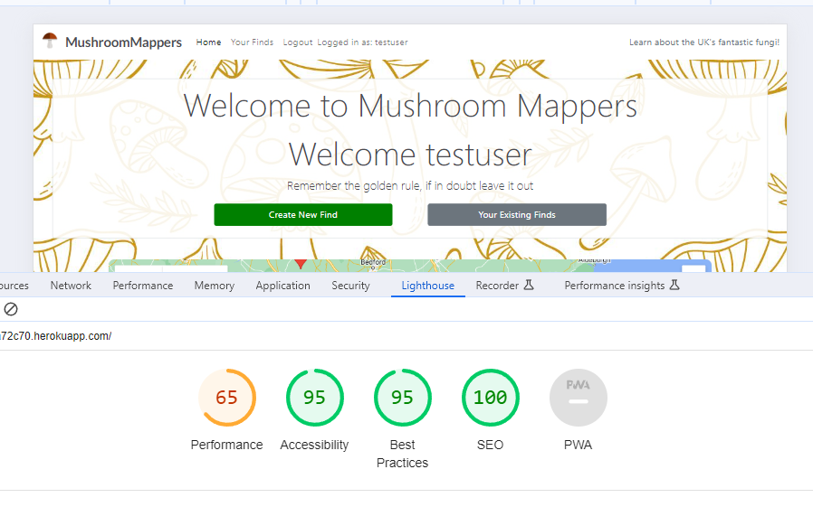
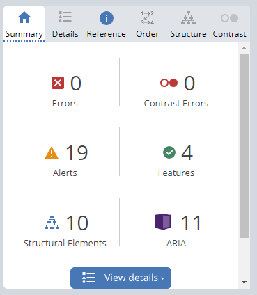

# Mushroom Mappers - Testing

## Testing

Testing was conducted at several stages throughout the development using Google Chrome Developer tools and later W3C validators.

Early issues identified in meetings with my mentor were:

- Maintaining good comments and document strings throughout the code.
- Ensuring views were using correct/relevant data from models to fulfil desired function.
- Configuring Cloudinary storage and static files correctly to ensure desired presentation and rendering on deployed application.

Later issues on first deploying my website, reviewed with my mentor were:

- Ensuring any custom created strings and URL's were correctly configured for the Heroku app. 
- Ensuring static files were collected and presented properly. 

## CONTENTS

- [Automated Testing](#automated-testing)
- [W3C Validator](#w3c-validator)
- [Lighthouse Testing](#lighthouse-testing)
- [Wave Testing](#wave-testing)
- [Manual Testing](#manual-testing)
- [Full Testing](#full-testing)
- [Homepage](#homepage)
- [Create Find Page](#create-find-page)
- [Edit find Page](#edit-find-page)
- [View Finds Page](#view-finds-page)
- [Find Detail Page](#find-detail-page)
- [Sign In Page](#sign-in-page)
- [Sign Out](#sign-out-page)
- [Registration Page](#registration-page)
-
- [Bugs](#bugs)
- [Solved Bugs](#solved-bugs)
- [Known Issues](#known-issues)

## Automated Testing

### W3C Validator

The W3C validator was used to validate all HTML pages and CSS.

- [Screenshot of CSS W3C Validated](documentation/w3c-css-validated.PNG)
- [Screenshot of homepage W3C Validated](documentation/w3c-homepage.PNG)
- [Screenshot of create find page W3C Validated](documentation/w3c-create-find.PNG)
- [Screenshot of edit find page W3C Validated](documentation/w3c-edit.PNG)
- [Screenshot of view finds page W3C Validated](documentation/w3c-view-finds.PNG)
- [Screenshot of sign in page W3C Validated](documentation/w3c-login.PNG)
- [Screenshot of sign out page W3C Validated](documentation/w3c-logout.PNG)
- [Screenshot of error page W3C Validated](documentation/w3c-404.PNG)

The trailing slash info message being raised by the viewport declaration was resolved. 

### Lighthouse Testing

Google chrome Lighthouse tester was used to assess SEO score, accessibility, conformance to best practices and overall performance. Please use the links below to view scores for each page on desktop or mobile:

#### Homepage Desktop Lighthouse Scores

#### Homepage Mobile Lighthouse Scores

#### Create Find Desktop Lighthouse Scores

#### Create Find Mobile Lighthouse Scores

#### Edit Find Desktop Lighthouse Scores

#### Edit Find Mobile Lighthouse Scores

#### View Finds Desktop Lighthouse Scores

#### View Finds Mobile Lighthouse Scores

#### View Sign In Page Desktop Lighthouse Scores

#### View Sign in Page Mobile Lighthouse Scores

#### View Sign Out Page Desktop Lighthouse Scores

#### View Sign Out Page Mobile Lighthouse Scores

#### View Sign Up Page Desktop Lighthouse Scores

#### View Sign Up Page Mobile Lighthouse Scores

#### 404 Error Page Desktop Lighthouse Scores

#### 404 Error Page Mobile Lighthouse Scores

#### Findings and Actions

The first lighthouse testing actually revealed poor scores for performance, particularly on mobile:

This was due to in part to the format of images which were being loaded. Converting these to webp where possible, for the static images, reduced the overall loading and improved performance. Performance was further improved by removing some CDN's and other links which were no longer needed in the final version.

A great deal of the impact on performance however comes from the imported libraries which are needed to load the Google map and to provide styling and some of the Javascript. Therefore they need to stay in as they are. Therefore some of the performance for mobile is not as high as I would like, but is necessary for the site to function. 

Overall I am very pleased with the Lighthouse scores for my pages. The vast majority of the scores however are 100% or extremely close to, so I am pleased that the work put into accessibility and performance has paid off across the vast majority of the pages.

In the future I would look at potentially scaling back the background for smaller screen sizes in some way, but from initial investigation this had major impacts on the over all look and feel of the pages, so was not something I could work into the scope of this project.

Other options could be forcing users to upload images of certain formats, but this could detract a lot from the usability and general friendliness of the site so is probably not a practical option. 

### WAVE Testing

Each page was assessed using the WAVE accessibility tool. Every page passed without any errors, please use the links below to view the scores for each page:

- 
- 
- 
- 
- 

After editing to include all alt tags, all pages passed without any errors. The majority of alerts raised in the testing, such as those on the homepage, were due to 'Very small text'. These were actually coming from the hidden div's which hold the data necessary for making map markers, so were not appearing on screen at all. These divs are needed for the map to function properly and despite exploring other options for holding the map marker data I could not find a suitable mechanism in the time frame for this project so they have remained as is. 

Another of the common alerts relates to a redundant link. This is the second home link on the nav bar. I have deliberately kept this, as when displayed on smaller screens and the burger menu is shown for the other nav items, I wanted a home option to appear in this dropdown list as well as the main MushroomMappers icon home link.

The view finds page could not be accessed by the WAVE testing site as it requires an authenticated user access. 

### Pep8 

Pep8 standards were maintained and checked for prior to final deployment using an in-built Pylint tool within MS Visual Code (Official Microsoft Pylint Tool). This raised some errors in relation to Find.Objects filtering, the tool seemed to suggest that there were no objects of Find, therefore no filtering could be done. However this clearly wasn't the case as removing this code presented all finds on the relevant screens. After research I discovered many other developers had the same issue when it comes to Django code, and that this is the linter being 'over sensitive' and not always accurate/useful for validating Django code. This was particularly evident in settings.py where the linter raised on issue stating that the import of env was not being used, which is clearly not the case.

For this reason, and the need to keep the code the same for functional purposes, I have kept the code as is and hope this is acceptable.

### JSHint

JS hint was used to check the script.js file. This raised a small number of variables which needed declaring more explicitly, some which needed moving to be in scope of other functions and some unused variables.

Warnings were also raised in relation to 'async functions only being available in ES8' however this function is required for the Google map to be created. This is a key part of Mushroom Mappers, therefore I have chosen to keep this as is, and accept that older browsers may run into issues with loading the code.

A warning was also raised in relation to a function being declared within a loop, however this is the standard panto() method which is imported as part of the library needed to run Google maps. I did not think it would be a good use of time to recreate this rather neat, ready made function, which operated perfectly well across multiple devices during the manual testing. Therefore, this code has been kept as is.

## Manual Testing

## Full Testing

Full testing of the website was performed on a Dell optiplex desktop on 25 inch Toshiba and Soundwave monitors, Dell Latitude 5510 14 inch screen laptop, iPad 8th generation, Samsung Galaxy S10, iPhone 14 pro.

Google chrome developer tools was also used to test at a range of different pixel sizes.

Testing was conducted using Google Chrome, MS Edge and Safari.

### Homepage

**Feature/Function**|**Expected Outcome**|**Method of Test**|**Result**|**Pass/Fail**
:-----:|:-----:|:-----:|:-----:|:-----:
Home Link|Return/refresh home page on click|Clicked link|Returned to home|Pass
Home Link Hover|Underline appears under text.|Hovered over link|Underline appeared|Pass
MushroomMappers Home Text|Return/refresh home page on click|Clicked link|Returned to home|Pass
MushroomMappers Home Text Hover|Underline appears under text.|Hovered over link|Underline appeared|Pass
IF USER NOT AUTHENTICATED| | | | 
Register Link|Returned to register/create account page|Clicked link|Returned to create account page|Pass
Register Link Hover|Underline appears under text.|Hovered over link|Underline appeared|Pass
Login Link|Returned to sign in page|Clicked link|Returned to sign in page|Pass
Login Link Hover|Underline appears under text.|Hovered over link|Underline appeared|Pass
IF USER AUTHENTICATED/SIGNED IN| | | | 
Home Link|Return/refresh home page on click|Clicked link|Returned to home|Pass
Home Link Hover|Underline appears under text.|Hovered over link|Underline appeared|Pass
Logout Link|Returned to sign out page|Clicked link|Returned to sign out page|Pass
Logout Link Hover|Underline appears under text.|Hovered over link|Underline appeared|Pass
View Finds Link|Returned to users View Finds page|Clicked link|Returned to users View Finds page|Pass
View Finds Link Hover|Returned to users View Finds page|Clicked link|Returned to users View Finds page|Pass
User name displayed|Item in nav bar should appear as "Logged in as: Username", After log in|Logged in|Item appear in nav bar displaying "Logged in as: Username.|Pass
FOOTER| | | | 
Facebook Icon Link|Opens Facebook in separate browser on click|Clicked icon|Opened Facebook in separate tab|Pass
Instagram Icon Link|Opens Instagram in separate browser on click|Clicked icon|Opened Instagram in separate tab|Pass
Twitter Icon Link|Opens Twitter in separate browser on click|Clicked icon|Opened Twitter in separate tab|Pass
Youtube Icon Link|Opens Youtube in separate browser on click|Clicked icon|Opened Youtube in separate tab|Pass
HOMEPAGE| | | | 
Continue Reading Link on Find - Click|Returns the relevant find detail page|Clicked continue reading link|Returned relevant find detail page|Pass
Continue Reading Link on Find - Hover|Text turns dark green with dark green box surrounding|Hovered over link|Text turned dark green with dark green box surrounding it|Pass
Map Marker Start Info Message|Map should load with welcome message centered on London|Map loaded|Welcome message centered on London|Pass
Map marker - Hover|Marker should display find title in info window|Hovered on map marker|Find title shown in info window|Pass
Map Marker - Click|Infowindow with "view find" link displayed inside it|Clicked marker|Link displayed in infowindow over marker|Pass
View Find from Marker|Redirect to relevant find details|Clicked link in map marker|Redirected to relevant find detail page|Pass
IF USER NOT AUTHENTICATED| | | | 
Register Button Click|Pale blue highlight around button, redirect to Sign Up page |Clicked button|Blue highlight appeared around button and redirected to sign up page|Pass
Register Button Hover|Button background turns darker green|Hovered over button|Button turned darker green|Pass
IF USER AUTHENTICATED| | | | 
Create Find Button|Returns the create find page|Clicked button|Redirected to create find page|Pass
Create Find Button Hover|Button turns dark green|Hovered over button|Button turned dark green|Pass
Your Existing Finds Button|Returns the user to view finds page, filtered to display finds they have created|Clicked button|Returned to view finds page with filtered list of finds|Pass
Your Existing Finds Button Hover|Button turns darker grey|Hovered over button|Button turned darker grey|Pass

### Create Find Page

**Feature/Function**|**Expected Outcome**|**Method of Test**|**Result**|**Pass/Fail**
:-----:|:-----:|:-----:|:-----:|:-----:
NAVBAR| | | | 
Home Link|Return/refresh home page on click|Clicked link|Returned to home|Pass
Home Link Hover|Underline appears under text.|Hovered over link|Underline appeared|Pass
MushroomMappers Home Text|Return/refresh home page on click|Clicked link|Returned to home|Pass
MushroomMappers Home Text Hover|Underline appears under text.|Hovered over link|Underline appeared|Pass
FOOTER| | | | 
Facebook Icon Link|Opens Facebook in separate browser on click|Clicked icon|Opened Facebook in separate tab|Pass
Instagram Icon Link|Opens Instagram in separate browser on click|Clicked icon|Opened Instagram in separate tab|Pass
Twitter Icon Link|Opens Twitter in separate browser on click|Clicked icon|Opened Twitter in separate tab|Pass
Youtube Icon Link|Opens Youtube in separate browser on click|Clicked icon|Opened Youtube in separate tab|Pass
CREATE FIND SPECIFICS| | | | 
Create new find (Poisonous) |Creation of new record for found mushroom |Form completion and submission via 'Submit' button |Submission created|Pass
Create new find (Edible)|Creation of new record for found mushroom |Form completion and submission via 'Submit' button |Submission created|Pass
Create new find - coordinate population |Coordinates accurately recorded in form submission by clicking on map |Clicking of location on map|Coordinates placed in form |Pass
Review of location view Google Street View |View of location in Google Street View|Clicking on Street View icon in map to review location digitally |Tool loaded and location visible online|Pass
Expansion of Google Map to full screen|Google Map to expand from partial to full screen view|Click on full screen expansion button in top right of the map to enlarge map |Map expanded to full screen |Pass
Zoom of Google Map to closer view of location|Google Map to zoom in to location in greater detail |Click on zoom in/out button on the map to zoom map |Map to zoom in/ out|Pass
Create new find - Confirm window (Cancel)|Pop up window to appear before submission of record - allows user to cancel submitting new find entry |Click 'Cancel' on pop up window |Entry cancelled |Pass
Create new find - Confirm window (Submit)|Pop up window to appear before submission of record - allows user to submit new find entry |Click 'Submit' on pop up window |Entry submitted|Pass
Create new find - Record not submitted if text box is blank |Form will not submit if Title, Content or Location boxes have missing text|Left box blank and attempted to submit entry|Entry will not save, form refreshes with empty box highlighted with blue outline|Pass

### Edit Find Page

**Feature/Function**|**Expected Outcome**|**Method of Test**|**Result**|**Pass/Fail**
:-----:|:-----:|:-----:|:-----:|:-----:
NAVBAR| | | | 
Home Link|Return/refresh home page on click|Clicked link|Returned to home|Pass
Home Link Hover|Underline appears under text.|Hovered over link|Underline appeared|Pass
MushroomMappers Home Text|Return/refresh home page on click|Clicked link|Returned to home|Pass
MushroomMappers Home Text Hover|Underline appears under text.|Hovered over link|Underline appeared|Pass
FOOTER| | | | 
Facebook Icon Link|Opens Facebook in separate browser on click|Clicked icon|Opened Facebook in separate tab|Pass
Instagram Icon Link|Opens Instagram in separate browser on click|Clicked icon|Opened Instagram in separate tab|Pass
Twitter Icon Link|Opens Twitter in separate browser on click|Clicked icon|Opened Twitter in separate tab|Pass
Youtube Icon Link|Opens Youtube in separate browser on click|Clicked icon|Opened Youtube in separate tab|Pass
EDIT FIND PAGE SPECIFICS| | | | 
Edit Find Button|Enter the edit find form - Confirmation window prompted|Clicked edit find button|Confirmation window prompted|Pass
Edit Find Button - Confirm Yes on prompt with valid form|With valid form data - find is edited and user returned to view finds page|Clicked okay on confirm window|Form details edited and user returned to view finds |Pass
Edit Find Button - Confirm Yes on prompt with invalid|returned to form with no submission|Clicked confirm button in confirmation message|Returned to form with no submission|Pass
Edit Find Button - Cancel on prompt|returned to form with no submission|Clicked cancel on confirmation window|Returned to form with no submission|Pass
Edit new find - coordinate population |Coordinates accurately replaced in form by clicking on map |Clicking of location on map|Coordinates placed in form |Pass
Review of location view Google Street View |View of location in Google Street View|Clicking on Street View icon in map to review location digitally |Tool loaded and location visible online|Pass
Expansion of Google Map to full screen|Google Map to expand from partial to ful screen view|Click on full screen expansion button in top right of the map to enlarge map |Map expanded to full screen |Pass
Zoom of Google Map to closer view of location|Google Map to zoom in to location in greater detail |Click on zoom in/out button on the map to zoom map |Map to zoom in/ out|Pass

### View Finds Page

**Feature/Function**|**Expected Outcome**|**Method of Test**|**Result**|**Pass/Fail**
:-----:|:-----:|:-----:|:-----:|:-----:
NAVBAR| | | | 
Home Link|Return/refresh home page on click|Clicked link|Returned to home|Pass
Home Link Hover|Underline appears under text.|Hovered over link|Underline appeared|Pass
MushroomMappers Home Text|Return/refresh home page on click|Clicked link|Returned to home|Pass
MushroomMappers Home Text Hover|Underline appears under text.|Hovered over link|Underline appeared|Pass
FOOTER| | | | 
Facebook Icon Link|Opens Facebook in separate browser on click|Clicked icon|Opened Facebook in separate tab|Pass
Instagram Icon Link|Opens Instagram in separate browser on click|Clicked icon|Opened Instagram in separate tab|Pass
Twitter Icon Link|Opens Twitter in separate browser on click|Clicked icon|Opened Twitter in separate tab|Pass
Youtube Icon Link|Opens Youtube in separate browser on click|Clicked icon|Opened Youtube in separate tab|Pass
VIEW FIND SPECIFICS| | | | 
Filtered list of Finds|Finds listed in View Finds should be filtered to currently logged in user|Entered View Finds|Finds listed filtered to logged in user|Pass
Edit Find Button|Enter the edit find form|Clicked edit find button|Entered edit find form|Pass
Delete Button|Confirmation message asking "Are you sure you want to delete this find?"|Clicked button|Confirmation message prompted|Pass
Delete Button Confirmation Message - Cancel|Confirmation message cancelled and returned to View Finds with no action taken.|Clicked cancel button in confirmation message|Confirmation message cancelled and returned to View Finds with no action taken.|Pass
Delete Button Confirmation Message - Confirm|Delete Find and returned to View Finds with updated list of Finds|Clicked confirm button in confirmation message|Find deleted and returned to View Finds with up to date list of Finds.|Pass

### Find Detail Page

**Feature/Function**|**Expected Outcome**|**Method of Test**|**Result**|**Pass/Fail**
:-----:|:-----:|:-----:|:-----:|:-----:
NAVBAR| | | | 
Home Link|Return/refresh home page on click|Clicked link|Returned to home|Pass
Home Link Hover|Underline appears under text.|Hovered over link|Underline appeared|Pass
MushroomMappers Home Text|Return/refresh home page on click|Clicked link|Returned to home|Pass
MushroomMappers Home Text Hover|Underline appears under text.|Hovered over link|Underline appeared|Pass
FOOTER| | | | 
Facebook Icon Link|Opens Facebook in separate browser on click|Clicked icon|Opened Facebook in separate tab|Pass
Instagram Icon Link|Opens Instagram in separate browser on click|Clicked icon|Opened Instagram in separate tab|Pass
Twitter Icon Link|Opens Twitter in separate browser on click|Clicked icon|Opened Twitter in separate tab|Pass
Youtube Icon Link|Opens Youtube in separate browser on click|Clicked icon|Opened Youtube in separate tab|Pass
FIND DETAIL SPECIFICS| | | | 
Edible Icon|If Find has suspected\_edible = True, then an icon of knife, fork and plate should appear |Entered find detail view of Find with suspected\_edible = True|Knife, fork and plate icon present on find description|Pass
Poisonous Icon|If Find has suspected\_poisonours = True, then a skull and crossbones warning icon should appear|Entered find detail view of Find with suspected\_poisonous = True|Skull and crossbones warning icon present on find description|Pass
Like Find|Counter of likes should increase by 1 and icon should change colour|Clicked Like Find|Likes counter increased by 1 and colour changed |Pass
Like Counter|Like counter should display heart icon with accurate count number next to it|View Find likes with multiple likes|Icon and count displayed accurately. |Pass
Comment Submit|Display message confirming comment successfully created on find, and is now awaiting approval|Typed text for a comment and clicked submit|Confirmation message displayed|Pass
View Comments|Other, authorised comments, displayed in relevant section on find detail|Viewed find with multiple approved comments, and other non-yet approved comments|Only approved comments visible on Find|Pass
Comments Counter|Speech bubble icon with number accurately displaying the number of approved comments|Viewed find with multiple approved comments, and other non-yet approved comments|Only approved comments included in count|Pass

### Sign in Page

Feature/Function	Expected Outcome	Method of Test	Result	Pass/Fail
NAVBAR				
Home Link	Return/refresh home page on click	Clicked link	Returned to home	Pass
Home Link Hover	Underline appears under text.	Hovered over link	Underline appeared	Pass
MushroomMappers Home Text	Return/refresh home page on click	Clicked link	Returned to home	Pass
MushroomMappers Home Text Hover	Underline appears under text.	Hovered over link	Underline appeared	Pass
FOOTER				
Facebook Icon Link	Opens Facebook in separate browser on click	Clicked icon	Opened Facebook in separate tab	Pass
Instagram Icon Link	Opens Instagram in separate browser on click	Clicked icon	Opened Instagram in separate tab	Pass
Twitter Icon Link	Opens Twitter in separate browser on click	Clicked icon	Opened Twitter in separate tab	Pass
Youtube Icon Link	Opens Youtube in separate browser on click	Clicked icon	Opened Youtube in separate tab	Pass
SIGN IN SPECIFICS				
Log in Button (fields not filled in)	No progress, prompted to fill in necessary fields	Clicked button	No progress, prompted to fill in fields	Pass
Log in Button (fields filled in)	Returned to home page as logged in user	Clicked button	Returned to home page as signed in user	Pass

### Sign Out Page

**Feature/Function**|**Expected Outcome**|**Method of Test**|**Result**|**Pass/Fail**
:-----:|:-----:|:-----:|:-----:|:-----:
NAVBAR| | | | 
Home Link|Return/refresh home page on click|Clicked link|Returned to home|Pass
Home Link Hover|Underline appears under text.|Hovered over link|Underline appeared|Pass
MushroomMappers Home Text|Return/refresh home page on click|Clicked link|Returned to home|Pass
MushroomMappers Home Text Hover|Underline appears under text.|Hovered over link|Underline appeared|Pass
FOOTER| | | | 
Facebook Icon Link|Opens Facebook in separate browser on click|Clicked icon|Opened Facebook in separate tab|Pass
Instagram Icon Link|Opens Instagram in separate browser on click|Clicked icon|Opened Instagram in separate tab|Pass
Twitter Icon Link|Opens Twitter in separate browser on click|Clicked icon|Opened Twitter in separate tab|Pass
Youtube Icon Link|Opens Youtube in separate browser on click|Clicked icon|Opened Youtube in separate tab|Pass
SIGN OUT SPECIFICS| | | | 
Log out Button|Returned to home page as generic, non authenticated user|Clicked button|Returned to home page as non authenticated user|Pass

### Registration Page 

**Feature/Function**|**Expected Outcome**|**Method of Test**|**Result**|**Pass/Fail**
:-----:|:-----:|:-----:|:-----:|:-----:
NAVBAR| | | | 
Home Link|Return/refresh home page on click|Clicked link|Returned to home|Pass
Home Link Hover|Underline appears under text.|Hovered over link|Underline appeared|Pass
MushroomMappers Home Text|Return/refresh home page on click|Clicked link|Returned to home|Pass
MushroomMappers Home Text Hover|Underline appears under text.|Hovered over link|Underline appeared|Pass
FOOTER| | | | 
Facebook Icon Link|Opens Facebook in separate browser on click|Clicked icon|Opened Facebook in separate tab|Pass
Instagram Icon Link|Opens Instagram in separate browser on click|Clicked icon|Opened Instagram in separate tab|Pass
Twitter Icon Link|Opens Twitter in separate browser on click|Clicked icon|Opened Twitter in separate tab|Pass
Youtube Icon Link|Opens Youtube in separate browser on click|Clicked icon|Opened Youtube in separate tab|Pass
REGISTRATION SPECIFICS| | | | 
Create Account Button (Fields not filled in)|No progression, prompted to fill out missing fields|Clicked button|No progression, prompted to fill out missing fields|Pass
Create Account Button (Fields filled in)|Confirmation |Clicked button|Returned to home page as non authenticated user|Pass

### 404 Error Page

**Feature/Function**|**Expected Outcome**|**Method of Test**|**Result**|**Pass/Fail**
-----|-----|-----|-----|-----
NAVBAR| | | | 
Home Link|Return/refresh home page on click|Clicked link|Returned to home|Pass
Home Link Hover|Underline appears under text.|Hovered over link|Underline appeared|Pass
MushroomMappers Home Text|Return/refresh home page on click|Clicked link|Returned to home|Pass
MushroomMappers Home Text Hover|Underline appears under text.|Hovered over link|Underline appeared|Pass
FOOTER| | | | 
Facebook Icon Link|Opens Facebook in separate browser on click|Clicked icon|Opened Facebook in separate tab|Pass
Instagram Icon Link|Opens Instagram in separate browser on click|Clicked icon|Opened Instagram in separate tab|Pass
Twitter Icon Link|Opens Twitter in separate browser on click|Clicked icon|Opened Twitter in separate tab|Pass
Youtube Icon Link|Opens Youtube in separate browser on click|Clicked icon|Opened Youtube in separate tab|Pass
404 Error Page Specifics| | | | 
404 error displayed|404 error displayed|Forced 404 error page|404 error displayed|Pass
Return home button|Returned to homepage|Clicked return home button|Returned to homepage|Pass

### 403 Error Page

**Feature/Function**|**Expected Outcome**|**Method of Test**|**Result**|**Pass/Fail**
-----|-----|-----|-----|-----
NAVBAR| | | | 
Home Link|Return/refresh home page on click|Clicked link|Returned to home|Pass
Home Link Hover|Underline appears under text.|Hovered over link|Underline appeared|Pass
MushroomMappers Home Text|Return/refresh home page on click|Clicked link|Returned to home|Pass
MushroomMappers Home Text Hover|Underline appears under text.|Hovered over link|Underline appeared|Pass
FOOTER| | | | 
Facebook Icon Link|Opens Facebook in separate browser on click|Clicked icon|Opened Facebook in separate tab|Pass
Instagram Icon Link|Opens Instagram in separate browser on click|Clicked icon|Opened Instagram in separate tab|Pass
Twitter Icon Link|Opens Twitter in separate browser on click|Clicked icon|Opened Twitter in separate tab|Pass
Youtube Icon Link|Opens Youtube in separate browser on click|Clicked icon|Opened Youtube in separate tab|Pass
403 Error Page Specifics| | | | 
403 error text displayed|403 error text displayed|Forced 403 error page|403 error text displayed|Pass
Return home button|Returned to homepage|Clicked return home button|Returned to homepage|Pass

### 500 Error Page

**Feature/Function**|**Expected Outcome**|**Method of Test**|**Result**|**Pass/Fail**
-----|-----|-----|-----|-----
NAVBAR| | | | 
Home Link|Return/refresh home page on click|Clicked link|Returned to home|Pass
Home Link Hover|Underline appears under text.|Hovered over link|Underline appeared|Pass
MushroomMappers Home Text|Return/refresh home page on click|Clicked link|Returned to home|Pass
MushroomMappers Home Text Hover|Underline appears under text.|Hovered over link|Underline appeared|Pass
FOOTER| | | | 
Facebook Icon Link|Opens Facebook in separate browser on click|Clicked icon|Opened Facebook in separate tab|Pass
Instagram Icon Link|Opens Instagram in separate browser on click|Clicked icon|Opened Instagram in separate tab|Pass
Twitter Icon Link|Opens Twitter in separate browser on click|Clicked icon|Opened Twitter in separate tab|Pass
Youtube Icon Link|Opens Youtube in separate browser on click|Clicked icon|Opened Youtube in separate tab|Pass
Error 500 Page Specifics| | | | 
Error 500 text displayed|Error 500 text displayed|Forced 500 error page|Error 500 text displayed|Pass
Return home button|Returned to homepage|Clicked return home button|Returned to homepage|Pass

## Bugs

### Solved Bugs

1. Database issue causing ReverseMatch error - I encountered the ReverseMatch error a couple of times during the development of Mushroom Mappers, however there was one particular instance which took a great deal of time and exploration to resolve despite going through the steps of checking the view, url and html code for errors. The peculiar thing in this instance was that the error did not appear when the particular page in question, when accessing the application as the admin. It only appeared as the 'normal' user. The error would raise when, as the normal user, I was trying to access the View Finds page, which shows a filtered page of Finds that the logged in user had created. In a way it was strangely comforting when, after eventually contacting Code Institute Student support, is also took them quite some time to identify the error. The issue actually came from one of the earlier Finds created for the purpose of testing, having been created without a slug. This was leading to errors when trying to view the View Finds page, because each Find was loaded with a link to view the details of that particular find. The html link requires the slug of the particular find to allow it to be rendered in the first instance. One of the earlier finds, created as the normal user, was created without a slug when I was developing an early version of the Create Find form, hence when trying to view this page as the normal user I was getting the error, but not as the admin, whose filtered view of View Finds did not contain the problem, slugless, find. With the help of Student support the find in question was deleted from the database and this resolved the error. 
Dealing with this bug highlighted to me the importance of understanding and ensuring the underlying base data is being sent and stored as desired. Had I been more careful in saving to the database initially I could have avoided running into these errors which led to me spending a long time investigating the code, when actually it was the data that was the issue. However this was a valuable lesson. 

2. Viewing User Attached/Uploaded Images - Whilst setting up the static folders and image storage was relatively simple, retrieving images which had been uploaded by a user via the create find form proved much more challenging. I could see that the url's for where the image was being hosted on Cloudinary were being saved correctly to the Find, by accessing the URL itself in the HTMl, but I couldn't retrieve the image itself. Using the url as img src simply didn't seem to render the image. After a great deal of investigation around the Django/Cloudinary API's, tweaking the create find view multiple finds, I eventually discovered the problem was with the create_find.html itself. A simple addition of enctype="multipart/form-data"> on the form element solved the issue. This defined the form as a multipart form, allowing the view to pick up both the text fields, and the image file. The view already had the necessary code of 
find_form = FindForm(request.POST, request.FILES)  , specifying that the view should take both text fields from the .POST and the image from .FILES. 

3. Http on edit or delete - Due to the way in which my views were set up, when a user edited or deleted a view (correctly) the form data would be edited or the entire find deleted respectively and the user would be returned to the view finds page. This would happen without any issues, and would appear okay, however with the original view set up the acted-on find slug would appear in the http:

Whilst this wasn't a major issue, as view_finds was still returned, it did mean that if for some reason a user refreshed at that particular moment after editing or deleting a find, the site would error, as that finds specific slug may have been edited or deleted entirely. To resolve this I used return HttpResponseRedirect(reverse('view_finds')) to specifically return the view_finds http, which would then correctly show an updated find list. 

4. Triggering Map Initialisation - Originally map initialisation was based on Javascript which looked for the number of divs that belonged to the 'hidden' class. On the index page there are multiple hidden divs to hold the data needed to create the map markers, on the create find page there is only 1. Therefore by getting the number of hidden div elements with a getElementsByClassName and using an if statement to compare the total number, JS could detect the index and create find page and render a specific map per page. However this option left the issue of an error being presented in the console log for any page which did not have any 'hidden' divs. Whilst this had no impact on the user experience of the site, I wanted to find a way to clear up the error for a general site cleanliness. The solution I found was to use querySelector inside an if statement, with similar counting logic e.g. if (document.querySelectorAll("div.hidden").length === 1) would recognise the create find page as this is the only page with only one hidden div. Any pages without hidden divs do not raise the error. 

5. Map Marker View Find on Heroku - I was very pleased with the eventual creation of the map markers, and that a user could click from the map to view a particular find. I was very worried when, much to my horror, this didn't work on the deployed Heroku app, instead I got a server 500 error. I investigated if this was due to the find needing to be approved, or perhaps being caught in some king of author-only access. However I realised that on Heroku, when clicking View Find on one of the map markers, it was actually trying to access a local server URL. After investigation this was due to this piece of code in the Javascipt:

Changing the text2 line, to make the template literal create a URL with the Heroku app URL solved this issue. 

### Known Issues

1. User Comment on Own Find Before Approval - It is possible, if a little self-indulgent, for a user to place a comment on their own find before it has been approved, if they access via View Finds. Normally any find which is not approved does not display in lists as per the querysets in views, however I feel it is important that a user has a place where they can still come and edit/delete finds whether or not they have been approved. A potential option to this is to remove the 'continue reading' option when viewing finds on View Finds, however this would mean all information, about every user find, would need to be displayed in the one page which would be large and cumbersome. Another option is to not give the user the ability to edit/delete until a find has been approved, but this seems a big loss of functionality for what is quite a specific case that is unlikely to come up in reality. If a user did need to come back to make changes to a find before it has been approved, they can, there is very little reason why in reality a use would comment on their own find before approval. 
To mitigate this I have incorporated instructions in the pages and messages, not to try and comment on a find before approval to help steer users away from the error. 